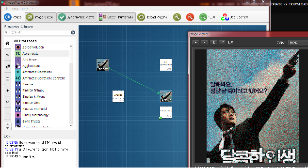

# ImagePlay

- 페이지 링크: https://github.com/cpvrlab/ImagePlay

ImagePlay 는 Image Processing 알고리즘을 미리 테스트 해보고 직접 만들어 볼 수 있는

rapid prototyping 툴입니다.

윈도우, 맥, 리눅스에서 다 돌아가네요.

재미있는 것은 내가 이미지 프로세싱을 설계를 하고 그것을 플레이 해 볼 수 있다는 점이 흥미롭습니다.

