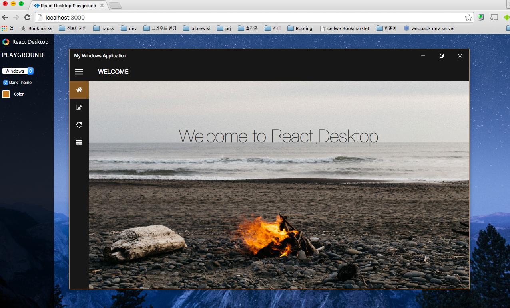

# react-desktop

- 페이지 링크: https://github.com/gabrielbull/react-desktop

React 는 12월 중에 연말 결산을 기획하고 있습니다.

React 시리즈 중 하나인 react-desktop은 [electron](https://github.com/atom/electron) 이나 node-webkit을 가지고 작업을 할 때
한번은 다들 꿈꿔보셨을 만한 생각을 현실화 한 프로젝트입니다.

electron 을 이용하면 웹으로 만들어 놓은 어플리케이션을 네이티브 웹앱으로 손쉽게 변환시켜 주죠.

하지만, 이것이 누가 봐도 웹앱이라는 느낌이 든다고 하면 여기에 react-desktop으로 UI를 만들어 준다면
어떤 고민도 없이 네이티브 어플리케이션 느낌이 들 거 같습니다.

백문이 불여일타!

"This library is in early Alpha and is subject to breaking change in the coming weeks."

라는 말을 무시하고 일단 설치 해보겠습니다.
(React 진영 프로젝트는 다른 어떤 곳보다 빠르게 프로젝트가 업데이트가 되고 있는 곳이긴 하니까 빨리 적응해야겠죠..)

```
npm WARN peerDependencies The peer dependency react@~0.14 included from react-desktop will no
npm WARN peerDependencies longer be automatically installed to fulfill the peerDependency
npm WARN peerDependencies in npm 3+. Your application will need to depend on it explicitly.
npm WARN peerDependencies The peer dependency react-dom@~0.14 included from react-desktop will no
npm WARN peerDependencies longer be automatically installed to fulfill the peerDependency
npm WARN peerDependencies in npm 3+. Your application will need to depend on it explicitly.

> fsevents@1.0.5 install /Users/keen/dev/work_desktop/node_modules/react-desktop/node_modules/radium/node_modules/babel/node_modules/chokidar/node_modules/fsevents
> node-pre-gyp install --fallback-to-build

[fsevents] Success: "/Users/keen/dev/work_desktop/node_modules/react-desktop/node_modules/radium/node_modules/babel/node_modules/chokidar/node_modules/fsevents/lib/binding/Release/node-v14-darwin-x64/fse.node" is installed via remote
|
> radium@0.14.3 postinstall /Users/keen/dev/work_desktop/node_modules/react-desktop/node_modules/radium
> node -e "require('fs').stat('lib', function(e,s){process.exit(e || !s.isDirectory() ? 1 : 0)})" || npm run lib

react-dom@0.14.3 node_modules/react-dom

react@0.14.3 node_modules/react
├── envify@3.4.0 (through@2.3.8, jstransform@10.1.0)
└── fbjs@0.3.2 (whatwg-fetch@0.9.0, ua-parser-js@0.7.9, loose-envify@1.1.0, promise@7.0.4, core-js@1.2.6)

react-desktop@0.1.48 node_modules/react-desktop
└── radium@0.14.3 (exenv@1.2.0, array-find@1.0.0, babel-plugin-flow-comments@1.0.9, is-plain-object@2.0.1, rimraf@2.4.4, babel@5.8.34)
```
별 무리 없이 일단은 진행이 된거 같구요.

[documentation](https://github.com/gabrielbull/react-desktop/blob/master/docs/README.md) 페이지의 것들을 좀 이용해 보려고 하는데!

coming soon이 대부분이네요.

그냥 설치만 해서 사용하고 node를 돌리려고 하니 너무나도 이젠 당연해져버렸지만 es6구문 때문에 샘플을 바로 실행할 수 없습니다.

그렇다면! 해당 프로젝트를 git clone 하시고!

```
npm install
npm run playground
```
를 실행 하시면 command line 에서 webpack 을 가동시키고 localhost:3000을 통해 샘플들을 확인해 보실 수 있습니다.

windows는 windows10 기준으로 만들어져 있어서 너무나 아름답네요.

OSX는 Elcapitan 기준이라고 하는군요. (git clone 을 하고 playground 폴더에 들어가시면 기본적으로 windows 만  import 받도록 되어 있습니다.)

혹시 OS X 화면을 확인하고 싶으시면

playground->playground.js파일의 아래 부분의 주석을 바꿔 주시면 원하는 바를 얻으실 수 있을 거 같습니다.

```
import React, { Component } from 'react';
import ReactDOM from 'react-dom';
// import {Window1 as Window1OSX, Window2 as Window2OSX} from './playground.osx';   --> 이 곳과
import {Window1 as Window1Win, Window2 as Window2Win} from './playground.win';      --> 이 곳을 적절히 확용!
import ColorPicker from 'react-color';
````

근데, 페이스북 이 친구들은 도대체 무슨 생각인 걸까요?


