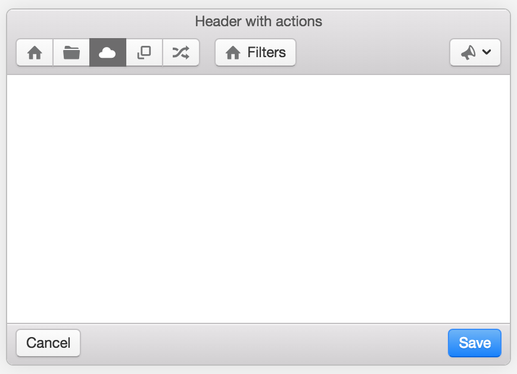

# photon

- 페이지 링크: https://github.com/connors/photon

이번 소개해드릴 깃헙 트랜드는 photon 입니다. 저는 처음 이름만 보고는 Starcreft의 photon cannon을 생각했는데요, 그래서 게임 관련 프로젝트인지 알았습니다. 제 생각과는 다르게 photon은 요즘 핫한 electron을 이용해 만드는 Desktop app 의 UI를 보다 쉽게 만들 수 있는 UI kit 입니다.

electron은 Web 기술인 html, css, javascript 등을 이용해 desktop app을 만들 수 있는 개발할 수 있게 해주는 프레임워크인데요.

photon의 셈플 [components](http://photonkit.com/components/)를 한번 보면 딱 느낌이 딱!!! 올 것 같습니다.

``` html
<header class="toolbar toolbar-header">
  <h1 class="title">Header with actions</h1>

  <div class="toolbar-actions">
    <div class="btn-group">
      <button class="btn btn-default">
        <span class="icon icon-home"></span>
      </button>
      <button class="btn btn-default">
        <span class="icon icon-folder"></span>
      </button>
      ...
    </div>

    <button class="btn btn-default">
      <span class="icon icon-home icon-text"></span>
      Filters
    </button>

    <button class="btn btn-default btn-dropdown pull-right">
      <span class="icon icon-megaphone"></span>
    </button>
  </div>
</header>

...

<footer class="toolbar toolbar-footer">
  <div class="toolbar-actions">
    <button class="btn btn-default">
      Cancel
    </button>

    <button class="btn btn-primary pull-right">
      Save
    </button>
  </div>
</footer>
```



이와 같이 photon에서 제공해주는 컨포넌트들을 이용해 쉽게 desktop UI를 만들어 낼 수 있습니다. [http://photonkit.com/](http://photonkit.com/) 에 방문해보시면 더 많은 정보와 컨포넌트를 볼 수 있습니다.

하지만 아직은 낮은 버전이기 때문에 electron을 production으로 사용할 때 photon을 이용하시는 것은 잘 고려해봐야 할 것 같네요.   
