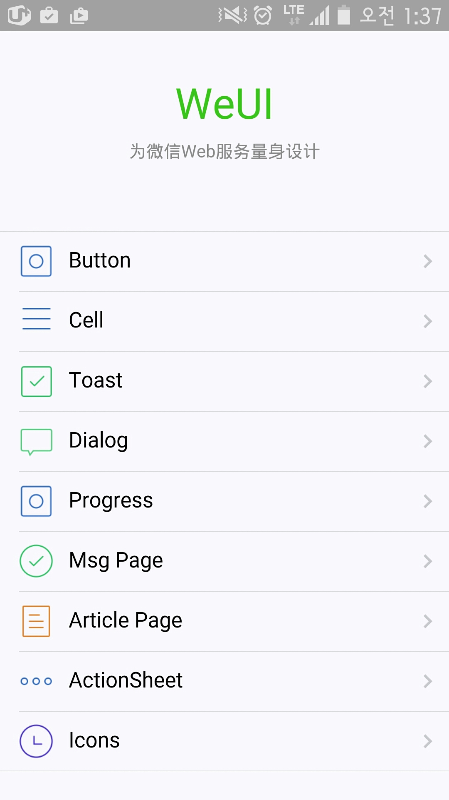

# weui

- 페이지 링크: https://github.com/weui/weui

### 개요
weui는 하이브리드앱에 유용한 위젯을 제공하는 UI라이브러리입니다.
Button, Cell, Toast, Dialog, Progress, Article, Icon 등의 컴포넌트를 제공합니다.
clone이 귀찮으시다면 먼저 [여기](http://weui.github.io/weui/)서 확인해 보세요.



### 다른 버전
sass버전과 react버전, vue버전으로 만들어져서 살펴보니 모두 개발자 이름이 다르네요. 관심있는 누군가가 만들지 않았나 추측해 봅니다.
- [kevyu/weui-sass](https://github.com/kevyu/weui-sass)
- [n7best/react-weui](https://github.com/n7best/react-weui)
- [aidenzou/vue-weui](https://github.com/aidenzou/vue-weui)

### 실행법
```
git clone https://github.com/weui/weui.git
cd weui
npm install -g gulp
npm install
gulp -ws
```
Readme에 나오는 그대로 실행하면 `http://localhost:8080/example`에서 확인할 수 있습니다.

