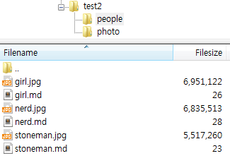
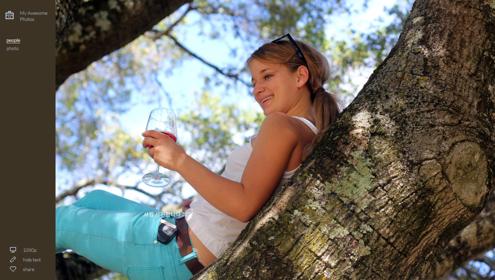

# Expose

- 페이지 링크: https://github.com/Jack000/Expose

사진찍어서 정리하기 좋아하시는 분들을 위한 프로젝트가 깃헙 트렌드에 나타났습니다.

정리된 폴더만 있으면 정적인 페이지를 만들어 준다고 소개되어 있네요.

개발자의 포토에세이 사이트는 [여기](http://jack.ventures/) 에서 보시면 이런 느낌으로 나오겠구나. 감이 오시죠?

저도 직접 테스트 해보기 위해 Mac에서 작업을 했습니다.

우선 임의로 test라는 폴더안에 people과 photo라는 폴더 두개를 만들었습니다.
 - people
 - photo

People 폴더 내부를 볼까요?

저는 들어갈 내용은 markdown으로, 이미지 파일 이름과 md의 이름은 같게 맞추어 주었습니다.

해당 폴더에서 expose를 실행 시키시고 살펴 보면?

결과물은!

왼쪽 메뉴
 - people / photo 폴더 두개가 그대로 나오구요.
 - left menu의 색은 사진에서 가장 많이 쓰인 색상이 조합되어 스크롤이 내릴때마다 바뀌는것 같습니다~

md에 작성한 글은 사진에 함께 나오는데, 경우에 따라 css만 다듬어서 쓰시면 될 것 같네요.

아래쪽 메뉴는
 - mobile이나 좀더 저화질로 보시려면, 1080p 부분의 옵션을 변경하면 됩니다.
 - hide text를 누르면, md나 txt로 작성하신 사진 설명부분이 사라집니다!
 - share를 누르면 hackernews, facebook, reddit, pinterest, twitter로 공유하실 수 있구요.