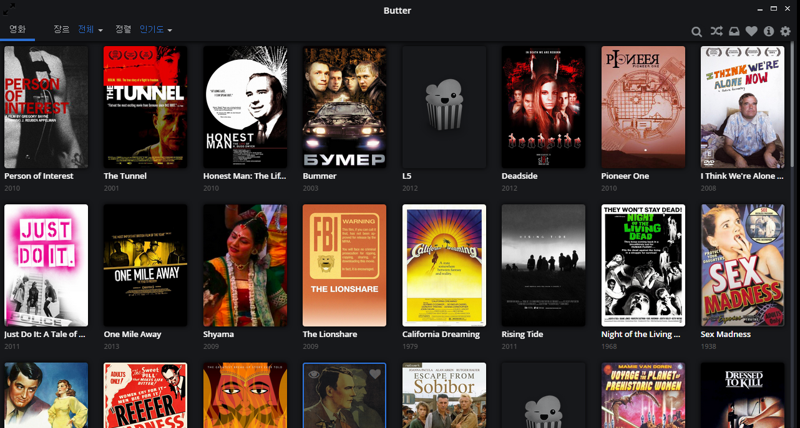
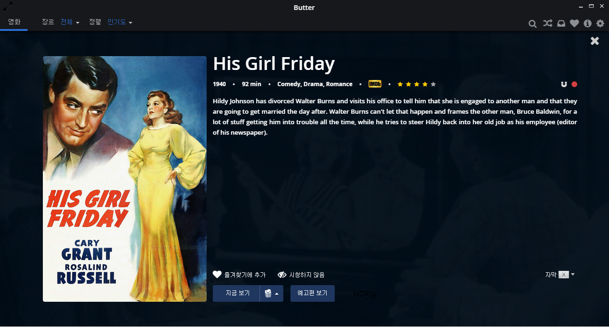
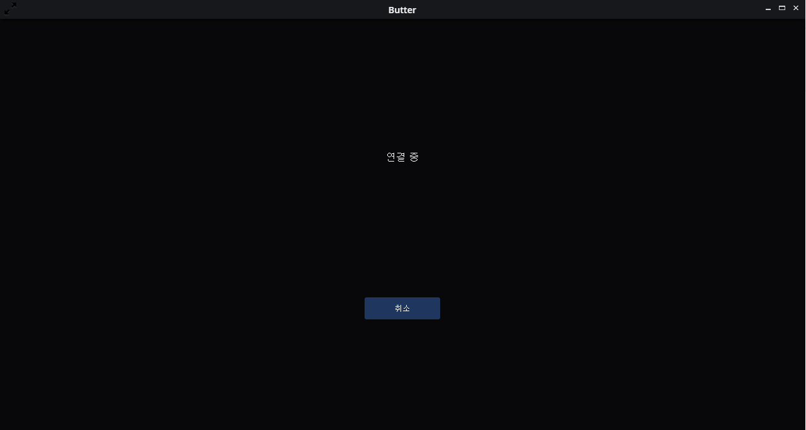

# butter-desktop

- 페이지 링크: https://github.com/butterproject/butter-desktop

토렌트로부터 영화와 TV쇼를 스트리밍 하는 어플리케이션입니다.

근데.... 이거 합법인가요?
[butterproject의 홈페이지](http://butterproject.org/)에서도 이렇게 이야기 하는군요..
" 저작권 있는 영상을 다운 받는 것은 불법일 수 있습니다. 책임은 본인이 져야 합니다..."
(저작권 문제 때문인건지 유명한 영화는 없었습니다)

자막이 있다면, 선택해서 볼 수도 있는 것 같습니다.
영화를 보려고 지금보기를 클릭했는데.......

속도 때문인지, 다른 이유인지 저는 영화는 보지 못했습니다.

#### Quickstart:
실행방법은 여기 있습니다.

1. `npm install -g grunt-cli bower`
1. `npm install`
1. `grunt build`
1. `grunt start`

실행방법은 이렇게 설명되어 있고, 안되면 아래 방법으로 시도해보세요.
전 위의 방법으로 성공했습니다.

1. `npm install -g bower grunt-cli` (Linux: you may need to run with `sudo`)
1. `cd desktop`
1. `npm install`
1. `bower install`
1. `grunt lang`
1. `grunt nwjs`
1. `grunt css`
1. `grunt start`

