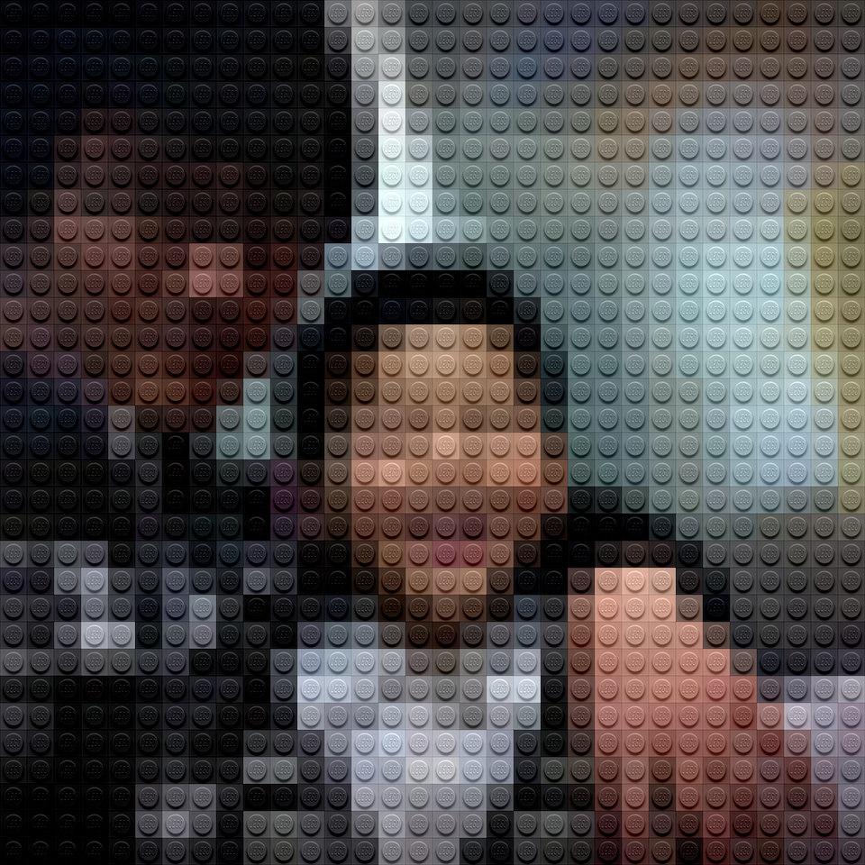

# Legofy

- 페이지 링크: https://github.com/JuanPotato/Legofy

이번 소개해드릴 깃헙 트렌드는 Legofy입니다. 이 프로젝트를 살펴보며 '참 세상에 재밌는 개발자들이 많구나!'라는 생각을 했습니다. 어떻게 하면 이런 기발한 생각을 할 수 있을까..라는 생각이 들더군요.

Legofy는 이미지를 레고 블럭처럼 보여주는 것인데요. 이런 기발한 프로젝트에 정말 수많은 개발자들이 재미와 흥미를 느꼈을 것 같습니다. 저도 바로 제 사진으로 테스트 해봤습니다.

깃헙에 있는 제 프로필 사진을 legofy로 수행해봤습니다. 처음에 에러가 나서 당황했는데, 제가 README를 제대로 읽지 않고, Requirements에 대한 설치를 잘 안해서 난 에러였습니다.

python이 설치되어 있어도, Pillow, click 모듈을 pip로 설치해주셔야합니다. 설치 후에 이미지를 처리해 볼 수 있습니다.

재밌는 Lego Block 사진을 손쉽게 만들어보세요~!
