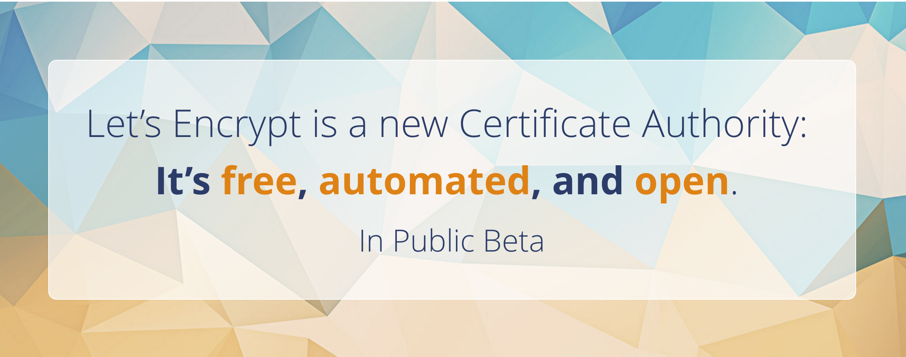

# letsencrypt

- 페이지 링크: https://github.com/letsencrypt/letsencrypt

이번 소개해드릴 깃헙 트랜드는 [Let's Encrypt](https://letsencrypt.org/)입니다.
HTTPS는 웹에서 보안을 위해 필요한데요, 대게 https를 사용하기 위해서는 SSL 인증서를 구매해야합니다. 돈이 많은 분들은 사서 쓰면 되지만, 개개인에게는 부담스럽죠.

Let's Encrypt는 SSL을 무료로 보급해 HTTPS를 누구든지 손쉽게 사용할 수 있도록 하는 프로젝트입니다. 작년에 프로젝트를 시작하면서 무료 SSL에 목말라있는 많은 사람들의 관심을 받아온 프로젝트죠. 드디어 지난 11월에 Public Beta를  12월에 진행하겠다고 발표를 했죠. 벌써 발빠르신 분들이 Let's Encrypt를 이용해보고 리뷰를 남겨주셨네요.

* [outsider - Lets' Encrypt로 무료로 HTTPS 지원하기](http://blog.outsider.ne.kr/1178)
* [블로그5 - Let’s Encrypt, 무료 인증서 Beta](https://wpu.kr/tip/lets-encrypt-beta/)

(사실 제가 영어도 짧고.. 인증서 관련해 전혀 몰라.. 이 블로그들 리뷰를 많이 참고했습니다..)

apache, standalone, webroot 그리고 nginx를 지원하며, 프로젝트를 clone 받아 실행하면 인증서를 받을 수 있습니다. 물론 도메인 인증만 지원되지만 그냥 HTTP를 사용하는 것 보다는 더 안전하겠죠?

이미 SSL을 구매해 사용하시는 분에게는 권하긴 어렵겠지만, 앞으로 HTTPS를 적용할 분들은 Let's Encrypt를 이용해보시고 SSL구매를 고려해보는 것도 좋을 것 같습니다. 
