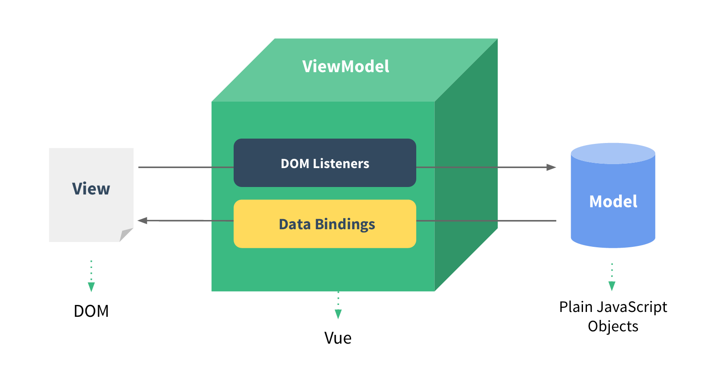

# vue

- 페이지 링크: https://github.com/vuejs/vue

안녕하세요. 이번에 소개해드릴 깃헙 트랜드는 vue입니다.

vue는 modern web interface를 만들기 위한 라이브러리라고 하는데요. 무려 스타가 10,000++ 입니다. 기존의 angular, react 등과 비슷한 역할을 수행 할 것이라 생각되는데요, 비슷하면서 또 차별점들이 있다고 합니다.


[http://vuejs.org/guide/#Two-way_Binding](http://vuejs.org/guide/#Two-way_Binding)

저는 angular를 살짝 기웃기웃 공부만 해서 깊게는 알지 못하지만, angular와 같은 two-way binding을 지원합니다. MVC 패턴도 비슷하지만 scope의 개념은 없으며, 해당 js import페이지나 dom에 한정시키는 것 같네요.



또 webcompoment의 Custom Elements나 react와 유사한 방법으로 component를 만드는데요. 하지만 polyfill 등의 사용하지 않고 사용할 수 있으며, virtual dom이 아닌 실제 dom을 이용하기 때문에 상태가 바꼈을 때 virtual dom이 re-render되는 문제가 없다고 하네요.


``` html
<div id="example">
  <my-component></my-component>
</div>
```

``` javascript
// define
var MyComponent = Vue.extend({
  template: '<div>A custom component!</div>'
})
// register
Vue.component('my-component', MyComponent)
// create a root instance
new Vue({
  el: '#example'
})
```


중국발 이 새로운 UI 프레임워크가 현재 react와 angular의 아성을 넘을 수 있을지 궁금하네요. react나 angular에 만족하지 못하는 분들이 계시다면 vuejs에 대해 한번 살펴보시길 추천드립니다.
