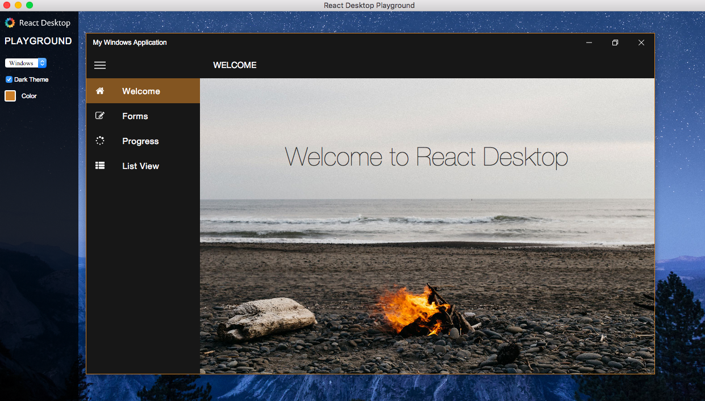

# electron

- 페이지 링크: https://github.com/atom/electron

electron 과 node-webkit이 생겨나오고 나서 수많은 데스크탑 어플리케이션들이 웹으로 작성되고 있습니다.

대표적인 얘가 제가 주 에디터로 사용하고 있는 Atom 에디터 겠죠.

node-webkit 이 요즘 업데이트 속도가 상당히 늦은데 비해 electron의 업데이트 속도는 상당히 빠릅니다.

그리고 기본적으로 컴파일하고 사용하기가 너무 쉽습니다.

OSX, Winodw, Linux 등을 모두 지원하는 것은 기본이고 패키징도 너무 간단합니다.

일단 패키징을 하기 위해서는 [asar](https://github.com/atom/asar) 을 이해 하시면 더 편리합니다.

일단 패키징 전에 electorn을 가지고 이번에 같이 소개하는 모듈인 react-desktop 의 sample 페이지를 돌려 보겠습니다.

```
git clone https://github.com/gabrielbull/react-desktop.git
```

해서 react-desktop의 페이지를 보시면  package.json 파일의 main : "./lib/index" 로 되어 있는 부분을
 "main.js" 로 바꾸시고 아래의 코드를 페이지에 추가합니다.

"main.js" 는 다음과 같습니다.

```
const electron = require('electron');
const app = electron.app;  // Module to control application life.
const BrowserWindow = electron.BrowserWindow;  // Module to create native browser window.

var webpack = require('webpack');
var WebpackDevServer = require('webpack-dev-server');
var config = require('./playground/webpack.config.js');

var server = new WebpackDevServer(webpack(config), {
  contentBase : __dirname+ "/playground",
  publicPath: config.output.publicPath,
  hot: true,
  quiet: false,
  noInfo: false
});

server.listen(3000, 'localhost', function (err) {
  if (err) {
    console.log(err);
  }
});

// Report crashes to our server.
electron.crashReporter.start();

// Keep a global reference of the window object, if you don't, the window will
// be closed automatically when the JavaScript object is garbage collected.
var mainWindow = null;

// Quit when all windows are closed.
app.on('window-all-closed', function() {
  // On OS X it is common for applications and their menu bar
  // to stay active until the user quits explicitly with Cmd + Q
  if (process.platform != 'darwin') {
    app.quit();
  }
});

// This method will be called when Electron has finished
// initialization and is ready to create browser windows.
app.on('ready', function() {
  // Create the browser window.
  mainWindow = new BrowserWindow({width: 1200, height: 800});

  // and load the index.html of the app.
  mainWindow.loadURL('http://localhost:3000');

  // Open the DevTools.
  // mainWindow.webContents.openDevTools();

  // Emitted when the window is closed.
  mainWindow.on('closed', function() {
    // Dereference the window object, usually you would store windows
    // in an array if your app supports multi windows, this is the time
    // when you should delete the corresponding element.
    mainWindow = null;
  });
});
```

그리고 ./playground/webpack.config.js 파일의 output path 만 아래왁 같이 고쳐 주시면
```
path: __dirname+'./playground/',
```

react-desktop 프로젝트에서

```
react-desktop> electron .
```

명령어를 통해서 아름다운 electron 과 react-desktop 의 앙상블을 구경하실 수 있습니다.

저는 좀 괴랄하지만 Mac 환경하에 windows 설정의 react-desktop 을 구현해 보았고 아래 보이는 이미지 대로 입니다.

감사합니다


