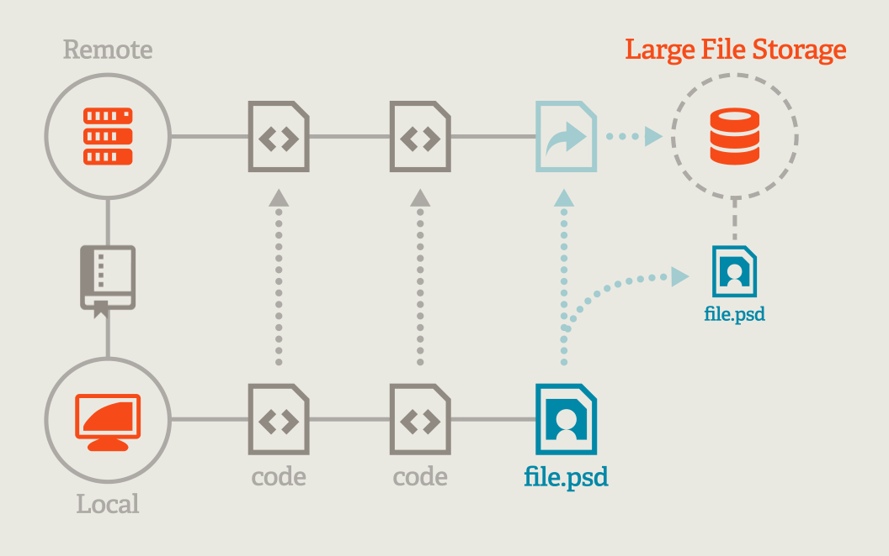

# Github Project

안녕하세요. Depa입니다. 2015년 깃헙트랜드 작성하면서 정말 많은 것을 배운 것 같네요. 저는 올 한 해 동안 Github에서 진행한 오픈소스를 살펴보도록 하겠습니다.

사실 github은 수많은 오픈소스의 커뮤니티이자 레파지토리를 하고 있지만, 정작 본인의 github 소스들에 대해서는 오픈소스화 하지 않고 있죠. 뭐 일부에서는 이를 비난할 수도 있습니다. 하지만 또 수많은 오픈 소스프로젝트를 운영하고 있죠. 올 한 발표했던 프로젝트들 중 github-trend에 올라온 프로젝트는 3건 정도입니다.(혹시.. 더 있다면 나중에 살짝쿵 말씀 주세요.)

1. git-lfs
2. electron
3. atom

### 1. git-lfs
github의 경우 100MB이상의 단일 파일은 용량제한에 걸리는데요. 대부분의 파일이 100MB이하이겠지만, 종종 큰 이미지나 오디오, 비디오 파일들은 이러한 용량을 넘어가게 되죠. 이런 파일을 효과적으로 관리하기 위해서 github에서 발표한 git 확장 프로젝트가  git-lfs입니다. 큰 용량의 파일에 대해서는 Remote쪽에 저장소를 따로 분리하여 관리하는 방식입니다. 사실 소스파일만 관리한다면 이 기능을 사용할 이유는 없겠지만, 다양한 대용량 파일들에 대한 형상관리가 필요하다면 사용을 고려해야겠죠.



놀라운 건 지난 11월 gitlab에서도 이 lfs를 지원하기로 한 것인데요. 본인들이 따로 만들기 보다는 경쟁사(?)이지만 좋은 오픈소스에 대해 반영하는 이런 모습이 참 대단하다고 생각했습니다.
1GB까지는 무료이니 대용량 파일 관리가 필요하신분들은 한번 사용해보세요.

### 2. electron(구 atom-shell)
electron은 atom editor를 개발하면서 같이 만들어진 프레임워입니다. nodejs, html, css등의 웹 기술을 이용해 크로미윰 기반의 desktop app을 만들수 있는 프로젝트입니다.

많이 알고 계시고 사용하시는 nw.js(구 node-webkit)과 유사하다고 생각됩니다. 차이점은.. [atom shell vs node webkit](https://github.com/atom/electron/blob/master/docs-translations/ko-KR/development/atom-shell-vs-node-webkit.md)을 읽어보시면 될 것 같습니다.

atom editor을 통해 cross platform 지원의 desktop app 개발을 증명하였고, 그외 다양한 프로젝트에서 electron을 이용해 많은 어플리케이션이 개발되었습니다.

아마 앞으로 더 많은 desktop앱들이 electron과 nw.js로 개발이 될것이라 생각됩니다.


### 3. atom
atom은 올해 깃헙에서 발표한 text editor인데요. 많은 분들이 sublime text를 더 선호하실지도 모르겠네요. 사실 저는 초보 개발자이라.. atom이 더 좋다, sublime text가 더 좋다.. 이런 부분 아직 잘 모르겠습니다. 특히 nodejs를 배울때 처음엔 sublime text를 이용했고, 그 뒤 선배들의 추천으로 atom으로 갈아탔고, 지금은 그냥 vim으로 개발하고 있습니다..

제가 지금까지 느낀 atom은 조금 버벅? 거리는 느낌이 있지만 더 이쁘고, 다양한 확장 기능을 이용할 수 있는 부분입니다. 물론 sublime도 확장 기능이 많지만, 웹 기반의 atom이 개인적으로 더 좋은 것 같아요. 특히 이렇게 깃헙 트랜드를 작성할 때 ```ctrl+shift+m```으로 MD Preview기능도 사용할 수 있죠. 또 ```activate power mode```같은 재미난 프로젝트도 있구요.

뭐 개취존중이죠!!! 혹시 만족스러운 Text Editor를 찾지 못하셨다면 atom도 꼭 한번 경험해보시면 좋을 것 같아요.

이렇게 위 3가지가 올해 Github에서 진행해 Github Trend에 올라왔던 프로젝트입니다. 이밖에 hub, hubot, gitignore, linguist 등의 다양한 프로젝트들이 아직도 활발하게 진행되고 있습니다. 비록 github 사이트 관련해 전부 오픈소스화 하지는 않았지만, developer.github.com 등의 페이지에 대해서는 오픈하기도 하였죠. 그리고 아직 오픈하지 않은 내부 프로젝트들도 많을 것이라 생각됩니다. 2016년에는 좀 더 재미난 깃헙 프로젝트를 기대합니다.

2016년에는 좀 더 실력을 키워 알차고 재미있는 깃헙트랜드 리뷰하도록 하겠습니다.
감사합니다.
