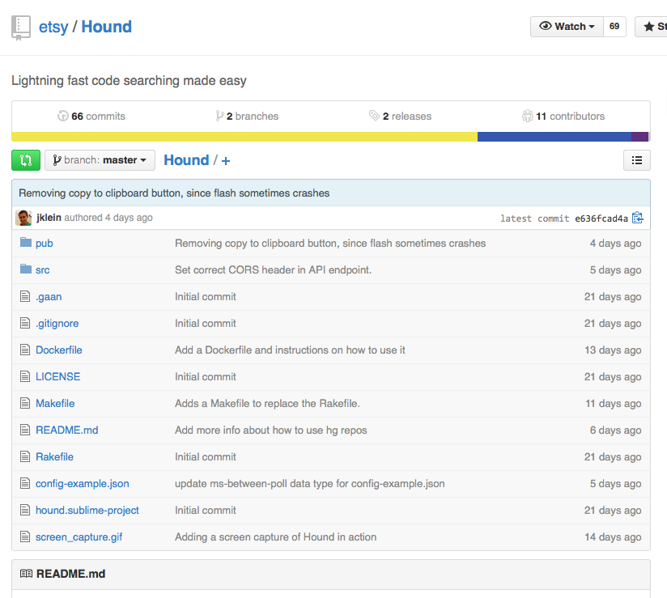

# 8. Hound

페이지 링크: https://github.com/etsy/Hound

사용 언어: Go

Hound는 극단적으로 빠른 소스코드 검색엔진이라는 자기 소개로 시작됩니다. ( 나 겁나 빠름. 어쩔.) 

trigram 인덱스를 활용한 정규식 매칭( http://swtch.com/%7Ersc/regexp/regexp4.html ) 이라는 글(논문?) 을 토대로 만들어졌다고 하는군요. 이글에서는 글쓴이가 구글 인턴으로 들어가서… 로 시작됩니다. 그리고는 잔뜩 알고리즘이 소개되어 있으니 정규식과 알고리즘에 관심이 있으신 분은 링크해 둔 사이트에 가셔서 참고하셔도 괜찮을 듯 싶습니다.

프론트엔드 단은 월간! 깃헙! 에서 훑고 지나간 React 로 되어 있구요, 서버단은 golang으로 되어 있네요.

UI 가 필요없다고 생각하는 사람은 Go 부분만 활요하는 부분에 대한 방법도 자세히 나와 있으니 한번 확인해 보는 것도 괜찮은 방법 같습니다.

서브라임 텍스트 같은 에디터의 플러그인도 제공하고 있고 도커 이미지도 제공하고 있네요.

이것도 다음 번에 심층해서 다뤄보도록 하겠습니다.

