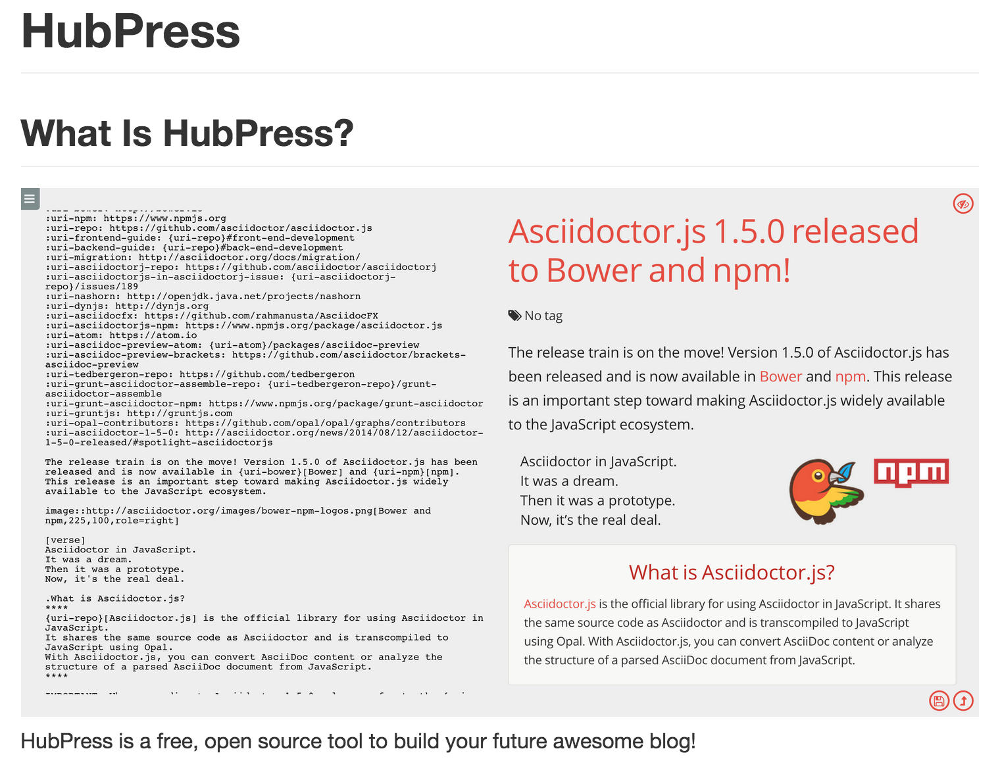

페이지 링크 : https://github.com/HubPress/hubpress.io

사용언어 : javascript, react

깃허브 블로그는 하나씩 가지고 계신가요?

전 이번 깃헙 트랜드를 작성하면서 hubpress로 제 블로그를 만들어 보았습니다.

http://depapepe.github.io/hubpress/

만드는데 1분 정도 걸린 것 같습니다.

하지만 아직 초기라서 그런지 약간의? 문제가 있어 보입니다.

published_at 구조로 폴더를 만들고 post title로 html 을 생성하는 구조여서 title에 한글을 사용하면 안됩니다.

그리고 아직 삭제 기능이 제공되지 않습니다. publish와 unpublish 를 통해 표시가 여부를 결정할 수는 있지만 admin 페이지에서 post들을 삭제를 할 수는 없습니다.

guide 된 방법으로 이미지를 사용할 수 없고, 또한 외부 이미지 링크가 publishing 하면서 변형되어 이미지가 깨지는 문제가 있습니다.  

또한 admin 페이지 url을 알면 (초기는 http://username.github.io/hubpress) admin 페이지에 타인도 접속 할 수 있습니다. 물론 데이터 수정은 되지 않습니다. 

이러한 부분들이 고쳐진다면 깃헙 블로그를 정말 쉽게 만들 수 있는 유용한 프로그램이라고 생각됩니다.

