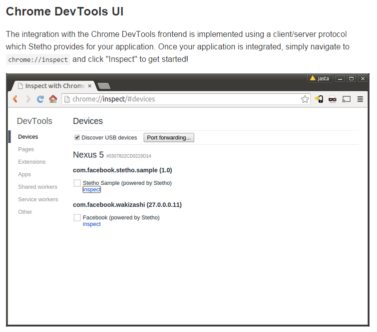
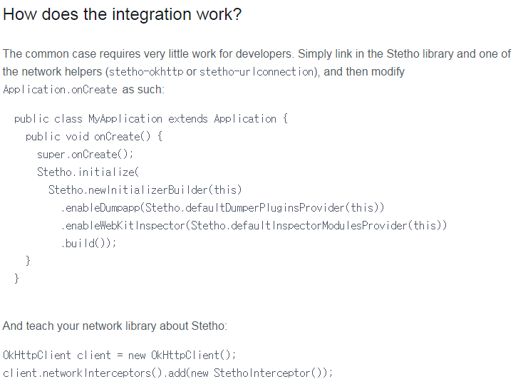
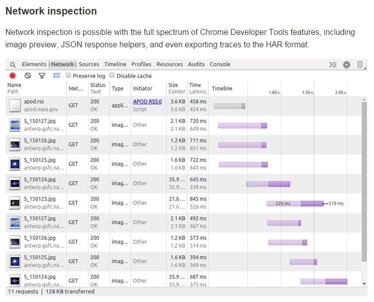
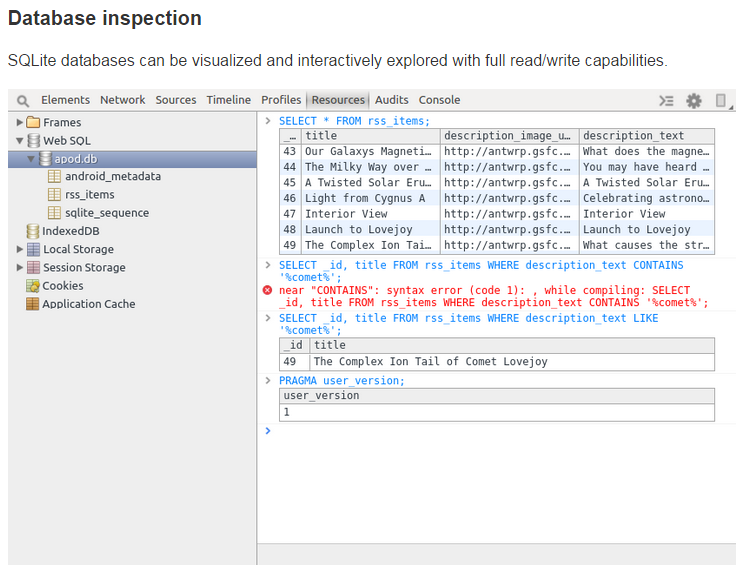

# 5. stetho

페이지 링크1 : https://github.com/facebook/stetho  
페이지 링크2 : https://code.facebook.com/posts/393927910787513/stetho-a-new-debugging-platform-for-android/  

stetho는 새로운 Android Debugging Platform 입니다.  
어떤 점에서 새롭냐면..바로 크롬을 통해서 디버깅을 한다는 겁니다!  
  
(대체 크롬의 끝은 어디인가요...)  

보통 안드로이드 개발은 이클립스에서 많이들 하시는데요.  
저 역시 이때까지 이클립스에서 개발하고 디버깅을 해왔습니다.

하지만 이젠 onCreate 함수에 코드 몇 줄 추가해주시고!

USB 케이블로 디바이스 연결만 뙇! 해주시면 크롬을 통해서 디버깅을 할 수 있습니다.  
심지어 네트워크와 디비까지 살펴볼 수 있다니..  

  

이제 리더처럼 묵직한 이클립스를 버리고 stetho를 한 번 써보시는 건 어떨가요?
