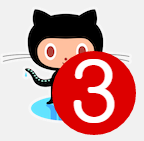

# 8. favico.js

페이지 링크: [https://github.com/ejci/favico.js](https://github.com/ejci/favico.js)

웹 서비스를 제공함에 있어 가장 중요한것은 뭘까요??

전 "디자인"이라고 생각합니다. ( 제 개인적인 생각 입니다 - Jump )

아무리 좋은 서비스라도 보기 불편한 디자인의 웹페이지에는 가고싶지 않기 때문이죠.

많은 디자인 요소가 있겠지만, 웹페이지의 아이덴티티는 파비콘에서 나온다고 생각합니다.

아무도 보지않는 웹브라우져의 구석에 존재하지만 즐겨찾기를 했을땐 그 아이콘으로 사람들이 알아보고 찾아오기 때문이죠.

favico.js 는 웹페이지 디자인에 날개를 달아줍니다

게다가!! 이미지 뿐만이 아니라 영상파일 마져도 파비콘이나 뱃지로 만들어 줍니다.

단순히 이미지를 보여주는 것 뿐만이 아니라 간단한 메세지도 아이콘 위에 써서 보여 줄 수 있지요.

마치 아래의 그림처럼요..

여러분의 웹 서비스에 날개를 달아 보세요!

[demo 페이지 링크](http://lab.ejci.net/favico.js/)

[Angular.js demo 페이지 링크](http://lab.ejci.net/favico.js/example-angular/#/)

