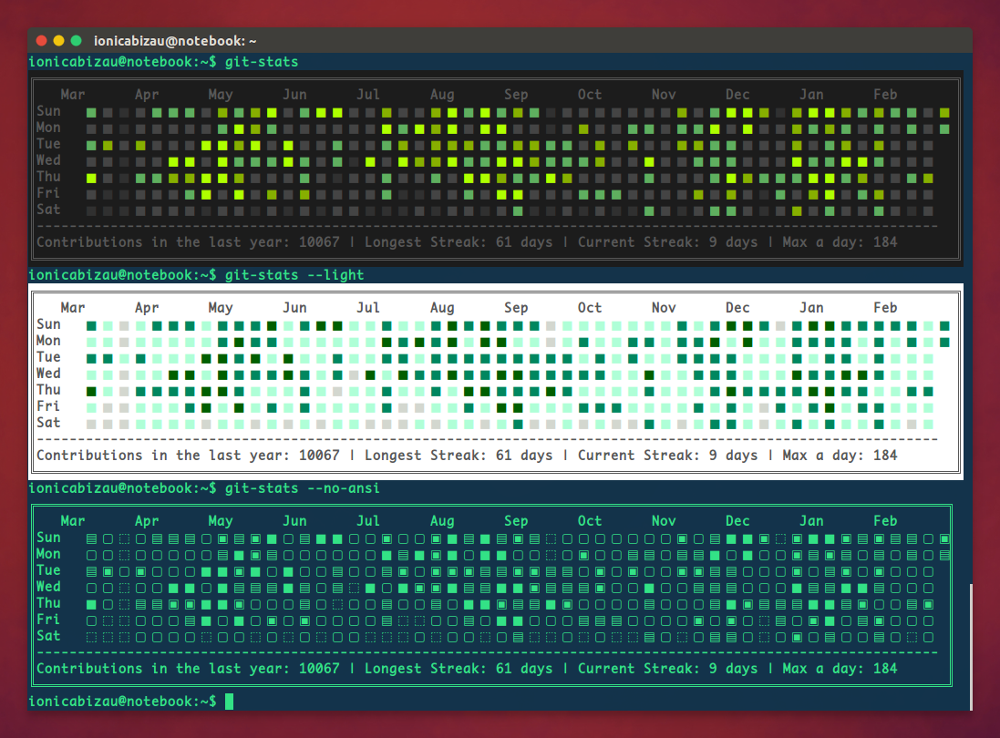

**Babel**은 차세대 자바스크립트를 트랜스컴파일러 입니다. (Previously 6to5)  
[https://babeljs.io/]( https://babeljs.io/)

질문이나 지원을 위해 이슈를 생성하기 전에 [gitter room](https://gitter.im/babel/babel)을 확인해 주시고, 문서와 웹사이트 이슈는  [babel.gihub.io](https://github.com/babel/babel.github.io)에 올려주세요.

##ES6 and beyond
Babel은 ES6+를 우리에게 좀 더 친숙한 ES5로 변환시켜 주고 브자우저 지원을 기다릴 필요 없이 당장 사용할 수 있습니다.[Learn more→](https://babeljs.io/docs/learn-es6/)

##JSX and React
Babel은  JSX번역기를 내장한 React와 완전한 조합을 보입니다. 문법의 하이라이팅을 원한다면 [babel-sublime](https://github.com/babel/babel-sublime) 패키지와 함께 사용하세요.

##Extensible
넓은범위의 [플러그인](https://babeljs.io/docs/using-babel/)으로 브라우저를 지원합니다.

