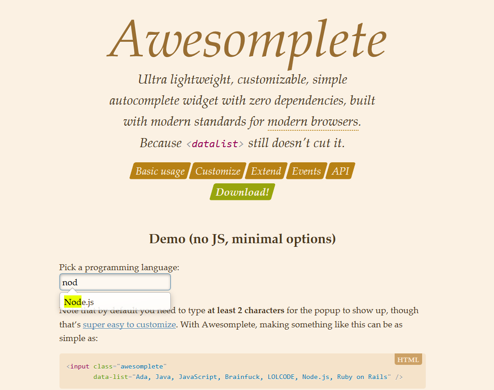

# 6. Highlight.js

페이지 링크: https://highlightjs.org/, https://github.com/isagalaev/highlight.js

코드의 가독성을 높이기 위해 하이라이트를 위한 스타일을 제공해 주는 라이브러리 입니다. 

기본적으로 브라우저에서도 효과적인 비주얼을 보여주지만 마크업에도 훌륭하게 적용할 수 있고,

서버측의 nodejs에도 적용이 가능하는 등 아주 유용할 뿐만 아니라

자동 언어 감지를 통해 사용자의 편의성면에서도 아주 훌륭한 성능을 보이고 있습니다. 

홈페이지에서 제공하는 패키지에는 기본적으로 js, css, c++ 등의 인기있는 22개의 언어의 하이라이트를 위한 

스타일이 포함되어 있지만 걱정마세요. 다른 마이너한 100여가지의 언어 스타일팩은 홈페이지의 [커스텀 다운로드](https://highlightjs.org/download/)를

통해 제공 받으실 수 있습니다. [데모](https://highlightjs.org/static/demo/)를 통해 먼저 확인해보세요.

 



### 기본 사용법

우선 다운 받은 패키지를 임포트합니다. 홈페이지를 통해 다운 받은 스타일팩을 링크를 걸어주셔도 되고
아래와 같이 cdn을 사용하셔도 됩니다.

cdnjs
```html
<link rel="stylesheet" href="//cdnjs.cloudflare.com/ajax/libs/highlight.js/8.4/styles/default.min.css">
<script src="//cdnjs.cloudflare.com/ajax/libs/highlight.js/8.4/highlight.min.js"></script>
```
jsdelivr
```html
<link rel="stylesheet" href="//cdn.jsdelivr.net/highlight.js/8.4/styles/default.min.css">
<script src="//cdn.jsdelivr.net/highlight.js/8.4/highlight.min.js"></script>
```

자 이제 준비는 되었습니다. [API](http://highlightjs.readthedocs.org/en/latest/api.html)를 참고하여 초기 설정을 해봅니다.

```html
<link rel="stylesheet" href="/path/to/styles/default.css">
<script src="/path/to/highlight.pack.js"></script>
<script>hljs.initHighlightingOnLoad();</script>
```
위의 코드를 통해 코드 안에서는 `<pre><code>`태그가 자동 감지 되어 스타일을 표기하게 됩니다.

만약 자동 감지가 제대로 되고 있지 않다면 아래의 코드처럼 클래스를 직접 지정해주세요


```html
<pre><code class="html">...</code></pre>
```

HighLight.js가 제공해주는 어떤 스타일도 적용하기 싫은 코드는 아래처럼 클래스를 'nohighlight'로 지정해주시면 됩니다.

```html
<pre><code class="nohighlight">...</code></pre>
```

참쉽죠? 
