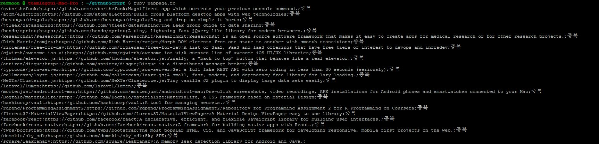
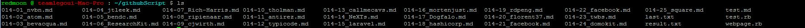
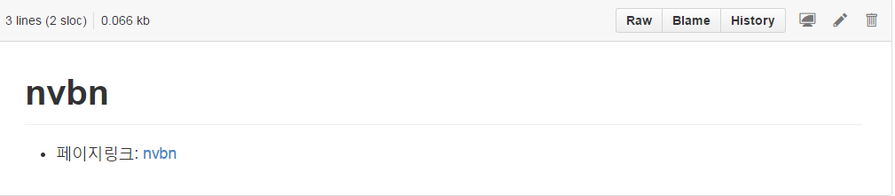

# 스크립트 실행 방법

안녕하세요. 제시카입니다. 

예전에 미키가 깃헙 트렌드 페이지에서 프로젝트명, description, url 등의 정보를 뽑아서 화면에 출력해주는 스크립트를 작성해주셨는데요..

"프로젝트명;description;url;중복여부"

이 포맷으로 출력되네요.. (덕분에 노가다를 줄일 수 있다는 ㅎㅎ)

거기에 추가로 md 파일을 자동으로 생성해주고, 파일 내에 프로젝트명과 페이지링크를 write 해주는 로직을 추가시켰습니다. 

https://github.com/TeamSEGO/github-trend-kr/tree/master/script

에서 스크립트와 last.txt(이전 프로젝트명 리스트를 담는 파일같은데, 추리는 노가다가 들어가야 할 듯 하여 사용하지는 않았습니다. 다음번에 이부분도 자동화가되면 좋을 듯 해요)를 받으셔서

>ruby webpage.rb

를 하시면

이런 식으로 출력이 될 거고(중복이라고 쓰인 부분은 무시하세요~!)

ls를 하시면 아래와 같이 md파일들이 주욱 생성될 겁니다.

돌리시기 전에

f = File.open("014-" + file_index + "_" + name[1] + ".md","w+")

이 코드의 "014" 부분을 해당 차수의 적합한 숫자로 변경해주세요.. 파일명 맨 앞에 들어가는 숫자입니다.

생성된 md파일 하나를 열어보면 아래와 같이 제목과 페이지링크가 적혀있는 걸 보실 수 있습니다.

실행은 루비를 설치하셔서 하셔도 되고, Mac 서버에 설치되어 있으니 거기서 돌리시면 되실듯 합니다. 

그럼 모두 즐거운 한 주 되세요~

 
